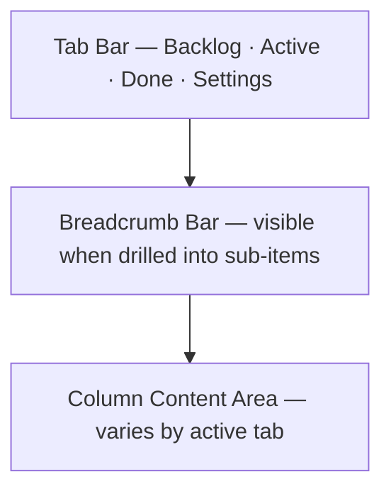
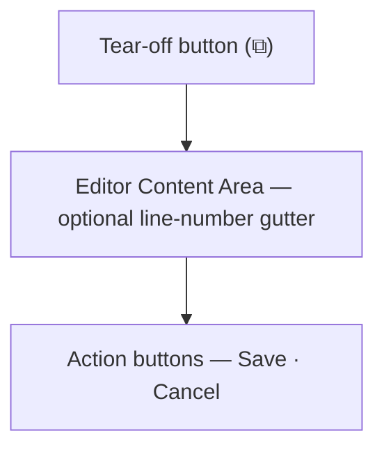
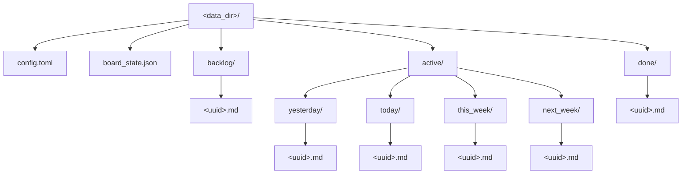

# Daily Kanban — User Guide

## 1. Overview

Daily Kanban (`dkb`) is a native macOS Kanban application for organising tasks across time horizons. It is built on the GPUI framework and stores every item as a plain Markdown file on disk, making your data fully portable and compatible with standard Markdown tooling.

### What it does

- **Time-horizon board** — Active items are spread across four columns: *Yesterday*, *Today*, *This Week*, and *Next Week*. Dedicated tabs cover *Backlog* and *Done*.
- **Plain Markdown persistence** — Each item is a `.md` file with YAML frontmatter timestamps, stored in a simple directory tree you can browse, sync, or version-control.
- **Sub-item hierarchy** — Any item can contain nested sub-items via standard Markdown links (`[Title](uuid.md)` or `[[uuid]]`). Drill down and up with breadcrumbs.
- **Integrated editor** — A modal Markdown editor with optional line numbers, font selection, and full Vi-mode editing. The editor can be torn off into its own window.
- **Drag-and-drop** — Reorder cards within a column or move them between columns by dragging. Order is persisted in `board_state.json`.
- **Theming** — Light, Dark, or Follow System appearance.
- **Localization** — 44 supported languages with automatic system detection.
- **External viewer** — Open any item in an external Markdown viewer (Marked, Marked 2, MD-Viewer, or a custom app).

### System requirements

- macOS 13.0+ (Ventura, Sonoma, Sequoia or newer)
- The GUI is launched by double-clicking the app or running `dkb` in a terminal. No command-line arguments are needed or supported.
- The `dk` command-line tool (see Section 13) can be used to manage items from a terminal or script.

---

## 2. The Main Window

The main window is divided into three regions:



### Tab bar

Four tabs live at the top of the window:

| Tab | Description |
|-----|-------------|
| **Backlog** | Single-column view of items not yet scheduled. |
| **Active** | Four-column Kanban: Yesterday, Today, This Week, Next Week. |
| **Done** | Single-column view of completed items. |
| **Settings** | Configuration screen (see Section 7). |

Click a tab to switch, or use the keyboard shortcuts listed in Appendix A.

### Breadcrumb bar

When you drill down into an item's sub-items, a breadcrumb trail appears below the tab bar showing the path of parent items. Click a breadcrumb or use `⌘ ←` to navigate back up.

---

## 3. The Active Board

The Active tab is the primary workspace. It displays four columns side by side:

| Column | Purpose |
|--------|---------|
| **Yesterday** | Items you worked on or planned for the previous day. Items from the Today column automatically roll over into Yesterday on the next day. |
| **Today** | Items you are working on right now. New items created from the Active tab default to this column. |
| **This Week** | Items planned for the current week but not necessarily today. |
| **Next Week** | Items planned for the upcoming week. |

### Cards

Each item appears as a card showing its cleaned title (Markdown headers, bold, italics, and links are stripped for display). If an item has sub-items, a `↪ <count>` badge appears indicating the total recursive sub-item count.

### Selecting items

- Click a card to select it. The selected card is highlighted.
- Use arrow keys or `h`/`j`/`k`/`l` to move the selection spatially.
- `Tab` / `Shift-Tab` cycles through all items on the current screen in order.

### Drag and drop

- Drag a card to another position in the same column to reorder.
- Drag a card to a different column to move it between time horizons.
- Drag a card to the Backlog or Done tab to change its status.
- The new order is saved immediately to `board_state.json`.

### Context menu

Right-click (or Control-click) any card to open a context menu with these options (varies by item location):

- **Open in Markdown Viewer** — launches the external viewer.
- **Open Editor** — opens the item in the integrated editor.
- **Move to Backlog** / **Move to Today** / **Mark Done** — context-dependent relocation.
- **Move Up** / **Move Down** — reorder within the current column.
- **Delete Item** — removes the item and its file from disk.

Click outside the menu or press any navigation key to dismiss it.

---

## 4. The Backlog Tab

The Backlog is a single-column view of items that are not yet scheduled. Items here have a `Backlog` status. You can:

- Create new items here (they are created in the Backlog column).
- Drag items to the Active tab to schedule them.
- Use `⌘ 1`–`⌘ 4` to move a selected item to an active column.
- Use `⌘ D` to mark an item as done (moves it to the Done tab).

---

## 5. The Done Tab

The Done tab shows all completed items in a single column. Items here have a `completed_at` timestamp in their frontmatter. You can:

- Reopen an item with `⌘ D` (moves it back to Today).
- Move an item to the Backlog with `⌘ B`.
- Delete items with `Delete` / `Backspace`.

---

## 6. Items and Sub-Items

### Creating items

| Action | Shortcut | Result |
|--------|----------|--------|
| New item | `⌘ N` | Opens an editor modal with the first line initialized to `# ` for the header. On save, the item is placed in the current screen's default column. |
| New sub-item (from board) | `⇧ ⌘ N` | Creates a new item and links it from the currently selected parent. Opens the editor for the new sub-item. |
| New sub-item (from editor) | `⌘ K` | If text is selected, turns the selection into a sub-item link and creates the file. If no text is selected, prompts for the sub-item title and inserts the link at the cursor. Also available via editor right-click. |

When creating a new item from the Active tab, it goes to **Today**. From the Backlog or Done tab, it goes to **Backlog**.

### Editing items

Press `Enter` or double-click a card to open the integrated Markdown editor (see Section 8). The editor opens as a modal overlay with fixed-width typography matching the line numbers gutter. You can:

- **Follow a link** by pressing `⌘ Enter` while the cursor is on or inside a link, or by `⌘ Click`ing the link.
- **Navigate back** to a parent item via `⌘ ←` / `⌘ [` or by clicking parent items in the editor breadcrumbs bar.
- **Save** with `⌘ S` or the Save button.
- **Cancel** with the Cancel button (discards changes if the item is new; for existing items, unsaved edits are lost).
- **Tear off** the editor into a separate window by clicking the window icon (⧉) in the editor's top bar.
- If the item is marked done, a green `✅ Done` badge is displayed in the editor top bar.

### Sub-item hierarchy

Sub-items are created by appending a Markdown link to the parent item's body. The link format is:

```
- [Sub-Item Title](uuid.md)
```

or using wiki-link syntax:

```
[[uuid]]
```

The application recursively counts all reachable sub-items and displays the count as `↪ <count>` on the parent card.

### Drilling down

| Action | Shortcut |
|--------|----------|
| Drill into sub-items | `⌘ →` (only if the item has sub-items) |
| Go back up | `⌘ ←` |

When you drill down, the view switches to a single "Sub-Items" column showing the children of the selected item. A breadcrumb trail appears at the top for navigation.

### Moving items between columns

| Shortcut | Destination |
|----------|-------------|
| `⌘ 1` | Yesterday |
| `⌘ 2` | Today |
| `⌘ 3` | This Week |
| `⌘ 4` | Next Week |
| `⌘ B` | Backlog |
| `⌘ D` | Toggle Done (active → done, done → today) |

### Reordering within a column

| Shortcut | Action |
|----------|--------|
| `⌘ ↑` or `⌘ K` | Move selected item up |
| `⌘ ↓` or `⌘ J` | Move selected item down |

### Deleting items

`Delete`, `Backspace`, `⌘ Delete`, or `⌘ Backspace` removes the selected item. The Markdown file is deleted from disk.

---

## 7. Settings Screen

Open the Settings tab with `⌘ ,` or by clicking the Settings tab. All changes are saved immediately to the config file.

### Appearance

Choose between three theme modes:

| Option | Behaviour |
|--------|-----------|
| **System** | Follows the macOS appearance (Light or Dark). |
| **Light** | Forces light theme. |
| **Dark** | Forces dark theme. |

### Vi Mode

Toggle Vi-mode editing on or off. When enabled, the integrated editor starts in Normal mode and supports the full range of Vi commands (see Appendix B). When disabled, the editor behaves as a standard text editor.

### Line Numbers

Toggle the line-number gutter in the Markdown editor on or off.

### Font Family

Select the monospace font used in the editor. The following fonts ship with macOS and are always available:

| Font | Ships with macOS |
|------|------------------|
| Menlo (default) | Yes |
| SF Mono | Yes |
| Monaco | Yes |
| Courier New | Yes |
| Courier | Yes |

Other monospace fonts may appear in the dropdown if they are installed separately on the system.

### Language

Choose the interface language from 44 supported options. Select **System Default (Auto)** to automatically detect the macOS system language.

### Markdown Viewer

Configure the external Markdown viewer:

- **Auto-Detect** — searches for Marked.app, Marked 2.app, or MD-Viewer.app in `/Applications` or `~/Applications`. Falls back to the system default Markdown handler if none are found.
- **Custom** — click **Browse...** to pick any `.app` bundle via the file dialog.
- Click **Reset to System Default** to return to Auto-Detect.

### Storage Directory

Displays the current data directory path. This is where all Markdown files and configuration are stored (see Section 9).

---

## 8. The Integrated Markdown Editor

The editor opens as a modal overlay when you create or edit an item. It provides a full-featured Markdown editing experience.

### Editor layout



### Tear-off window

Click the ⧉ icon in the top-right corner to pop the editor out into its own independent window. This is useful when you want to keep the Kanban board visible while editing an item at length.

### Standard editing shortcuts

These work in both Vi and non-Vi modes:

| Shortcut | Action |
|----------|--------|
| `⌘ S` | Save |
| `⌘ K` | Create sub-item (from selection or prompt) |
| `⌘ Enter` | Follow link under cursor |
| `⌘ Click` | Follow clicked link |
| `⌘ ←` / `⌘ [` | Navigate back to parent item |
| `⌘ A` | Select all |
| `⌘ C` | Copy |
| `⌘ X` | Cut |
| `⌘ V` | Paste |
| `⌘ Z` | Undo |
| `⇧ ⌘ Z` | Redo |
| `↑ ↓ ← →` | Move cursor |
| `Shift + arrows` | Extend selection |
| `Enter` | Insert newline |
| `Backspace` / `Delete` | Delete character |
| `Esc` | Return to Normal mode (Vi mode only) |

### Cursor and typography

- **Cursor display:** In Vi Normal/Command mode, the cursor appears as a solid, blinking box. In Edit/Insert mode, the cursor appears as a blinking vertical line. The cursor is always visible and blinks smoothly when focused.
- **Typography:** The editor uses a fixed-width monospace font (Menlo by default, configurable in Settings). The line-number gutter matches the editor text font family, size, and line height.
- **Default header:** Newly created items automatically open with `# ` on the first line and the cursor placed after it for immediate title entry.

### Vi mode

When Vi mode is enabled in Settings, the editor operates in modal fashion with six modes: Normal, Insert, Visual (character), Visual (line), Command (ex), Search, and Replace. The current mode is displayed in the status bar. See **Appendix B** for the full command reference.

---

## 9. Data Storage and File Format

### Default location

All data is stored under:

```
~/Library/Application Support/dkb/
```

### Directory structure

```
dkb/
├── config.toml              ← Application configuration
├── board_state.json         ← Card ordering within columns
├── backlog/
│   ├── <uuid>.md
│   └── ...
├── active/
│   ├── yesterday/
│   │   └── <uuid>.md
│   ├── today/
│   │   └── <uuid>.md
│   ├── this_week/
│   │   └── <uuid>.md
│   └── next_week/
│       └── <uuid>.md
└── done/
    └── <uuid>.md
```

### Markdown file format

Each item is a Markdown file named `<uuid>.md` with YAML frontmatter:

```markdown
---
created_at: 2026-08-15T10:30:00Z
updated_at: 2026-08-15T14:22:00Z
completed_at: 2026-08-15T16:00:00Z   # only for Done items
---
# My Task Title

Body text goes here. Sub-items are linked as:

- [Sub-Task](abc12345-....md)
```

The first non-empty line of the body becomes the card title. Markdown formatting (`#`, `**`, `*`, `` ` ``, `~`, `[text](url)`) is stripped for display.

### Configuration file

`config.toml` is a TOML file with the following fields:

```toml
data_dir = "/Users/you/Library/Application Support/dkb"
vi_mode = false
line_numbers = false
theme_mode = "system"          # "light", "dark", or "system"
language = "auto"              # see Appendix C for codes
markdown_viewer = "auto"       # "auto" or { custom = "/path/to/app" }
font_family = "Menlo"
```

The config file is created automatically with defaults on first launch if it does not exist.

### Board state

`board_state.json` persists the order of cards within each column. This file is updated automatically whenever you drag, move, or reorder items.

### iwe integration

The application uses standard Markdown link syntax (`[Title](uuid.md)` and `[[uuid]]`) that is compatible with the [iwe](https://iwe.md) markdown knowledge graph. If iwe is installed on your system, it can navigate and browse your items directly from the data directory. iwe is not bundled or required.

---

## 10. Windows and Multi-Window

| Shortcut | Action |
|----------|--------|
| `⌘ ⌥ N` | Open a new main Kanban window |
| `⌘ W` | Close the current window, or close the editor modal if open, or dismiss the context menu if open |
| `⌘ Q` | Quit the application |

New windows are independent instances of the full Kanban view, sharing the same data directory.

---

## 11. External Markdown Viewer

Any item can be opened in an external Markdown viewer application:

- Press `⇧ ⌘ M` with an item selected, or
- Right-click an item and choose **Open in Markdown Viewer**, or
- Use the **Item → Open in Markdown Viewer** menu.

The viewer is configured in Settings (see Section 7). If set to Auto-Detect, the app searches for Marked.app, Marked 2.app, or MD-Viewer.app, then falls back to the system default handler for `.md` files.

---

## 12. Application Menus

### dkb menu
- **Settings...** (`⌘ ,`) — Open the Settings tab.
- **Quit dkb** (`⌘ Q`) — Quit the application.

### File menu
- **New Item** (`⌘ N`) — Create a new item.
- **New Sub-item** (`⇧ ⌘ N`) — Create a sub-item under the selected card.
- **New Window** (`⌘ ⌥ N`) — Open a new main window.
- **Close Window** (`⌘ W`) — Close the current window.

### View menu
- **Backlog** (`⇧ ⌘ B`) — Switch to Backlog tab.
- **Active** (`⇧ ⌘ A`) — Switch to Active tab.
- **Done** (`⇧ ⌘ D`) — Switch to Done tab.
- **Move Right** (`⌘ ]`) — Next column.
- **Move Left** (`⌘ [`) — Previous column.

### Item menu
- **Open in Markdown Viewer** (`⇧ ⌘ M`) — Open selected item externally.
- **Open Editor** (`Enter`) — Open the integrated editor.
- **Move Up** (`⌘ ↑`) — Reorder up within column.
- **Move Down** (`⌘ ↓`) — Reorder down within column.
- **Move to Backlog** (`⌘ B`)
- **Move to Yesterday** (`⌘ 1`)
- **Move to Today** (`⌘ 2`)
- **Move to This Week** (`⌘ 3`)
- **Move to Next Week** (`⌘ 4`)
- **Mark Done** (`⌘ D`) — Toggle done/reopen.
- **Delete Item** (`Delete`)

### Edit menu
- **Undo** (`⌘ Z`) — Editor undo.
- **Redo** (`⇧ ⌘ Z`) — Editor redo.
- **Cut** (`⌘ X`)
- **Copy** (`⌘ C`)
- **Paste** (`⌘ V`)
- **Select All** (`⌘ A`)

---

## 13. The `dk` Command-Line Tool

Daily Kanban ships with a companion CLI, `dk`, that operates on the same data directory as the GUI. It is useful for quick edits from a terminal, scripting, and use over SSH. The GUI and CLI can be used interchangeably on the same board — they share `config.toml` and `board_state.json`.

### Installing the `dk` command

Open **Settings** (`⌘ ,`) and scroll to the **CLI Tool** section. Click **Install dk command** to create a symlink from `~/.local/bin/dk` to the `dk` binary bundled inside the app. Ensure `~/.local/bin` is in your shell's `PATH` (add `export PATH="$HOME/.local/bin:$PATH"` to your `~/.zshrc` or `~/.bashrc` if needed).

After installing, verify with:

```
which dk
dk ls
```

The CLI keeps a small state file, `cli_state.json`, in the data directory. This records the **current item** (the last item picked, created, or moved) and the **last list** (the order of items shown by the most recent `dk list`). Several commands refer back to these to resolve shorthand selectors like `3` or `yesterday/1`.

### Commands at a glance

| Command | Alias | Purpose |
|---------|-------|---------|
| `dk new [category]` | `dk n` | Create a new item by launching your editor. |
| `dk list [category]` | `dk ls` | List items and remember their indices. |
| `dk pick <selection>` | `dk p` | Set the current item. |
| `dk edit [selection...]` | `dk ed` | Open one or more items in your editor. |
| `dk show [selection]` | `dk s` | Display an item via $PAGER or stdout. |
| `dk move <selection> <category>` | `dk mv` | Move an item to a different column. |
| `dk delete [selection...] [-f]` | `dk rm` | Delete items, with confirmation. |

### Category aliases

Commands that accept a category (`new`, `list`, `move`) understand the following aliases (case-insensitive):

| Category | Aliases |
|----------|---------|
| Backlog | `b`, `backlog` |
| Yesterday | `y`, `yesterday` |
| Today | `t`, `today` |
| This Week | `tw`, `thisweek`, `this_week` |
| Next Week | `nw`, `nextweek`, `next_week` |
| Done | `d`, `done` |

### Selectors

`pick`, `edit`, `move`, and `delete` all accept the same selector forms:

| Form | Meaning |
|------|---------|
| *no argument* | The current item (set via `pick`, `new`, or `move`). |
| `<number>` | The item at that index in the most recent `dk list` output. |
| `<category>/<number>` | The item at that index within the given category (e.g. `backlog/0`). |
| `<uuid>` or `<uuid>.md` | The item with that UUID. |
| `<path>` | Absolute path or relative path to the item's `.md` file. |

The index is the 0-based number printed by `dk list`. Indices only remain valid until the next `dk list` run; the CLI remembers the last list so that `dk pick 3` knows which list "3" refers to.

### Editor selection

`new` and `edit` launch an external editor seeded with the item body. The editor is chosen in this order:

1. `$VISUAL` if set,
2. `$EDITOR` if set,
3. `vi` as a final fallback.

The value may include arguments (for example, `EDITOR="code --wait"`). The cursor is positioned with `+line:col` syntax; `new` opens at `+1:3` (after the `# ` header) and `edit` opens at `+1:1`.

### `dk new` / `dk n`

Creates a new item by opening your editor on a temp file pre-seeded with `# `. On save, the file becomes the item body and is written to the chosen category (Backlog by default). If the editor is saved with only `#` or an empty body, the operation is aborted. The new item is marked current.

```
dk n                    # new Backlog item
dk new today           # new Today item
dk n tw                # new This Week item
dk new nextweek
dk n d                 # new Done item
```

### `dk list` / `dk ls`

Lists items and remembers their order so subsequent selectors like `3` work. With no argument it lists all four active columns in order: Yesterday, Today, This Week, Next Week. `backlog` and `done` are only shown when requested explicitly.

Each row begins with the index (right-justified to the widest index in the list) followed by the cleaned title (Markdown formatting stripped), truncated to fit the terminal without wrapping. The current item's row is prefixed with `* ` instead of its index.

```
dk ls                  # all active items
dk ls backlog          # Backlog items
dk ls done            # Done items
dk ls yesterday       # only Yesterday
```

If there are no items to show, `dk` prints `(no items)`.

### `dk pick` / `dk p`

Sets the current item. Prints the picked item's title and UUID. Requires a selector argument — there is no "pick current" since that is a no-op.

```
dk p 3                 # pick index 3 from the last `dk list`
dk pick backlog/0      # pick the first Backlog item
dk pick 550e8400-e29b-41d4-a716-446655440000.md
```

### `dk edit` / `dk ed`

Opens the selected item(s) in your editor, one at a time in the order given. With no arguments it edits the current item. The edited body replaces the item body and `updated_at` is refreshed. The item stays in its current category.

```
dk ed                  # edit current item
dk edit 3              # edit index 3
dk edit 3 5 9          # edit several items sequentially
dk edit 550e8400-e29b-41d4-a716-446655440000.md
dk edit backlog/2      # edit the third Backlog item
```

### `dk show` / `dk s`

Displays an item's content. When output is a terminal, uses `$PAGER` (defaulting to `less`). When piped, streams the raw content to stdout without invoking a pager. With no argument, shows the current item. Selection uses the same mechanism as edit.

```
dk s                    # show current item
dk show 3               # show item at index 3
dk show backlog/0       # show first Backlog item
dk show 550e8400-e29b-41d4-a716-446655440000.md
```

### `dk move` / `dk mv`

Moves an item to a different category. Requires a selector and a destination category. Prints the moved item's title and its new location.

```
dk mv 3 done           # move item 3 to Done
dk mv yesterday/1 today
dk mv backlog nextweek
dk mv 3 b              # move item 3 to Backlog
```

### `dk delete` / `dk rm`

Deletes one or more items. With no arguments it deletes the current item. By default each deletion prompts for confirmation (`y`/`Y` to proceed, anything else aborts). Pass `-f` or `--force` to skip the prompt. Deleting the current item clears the current-item marker.

```
dk rm                  # delete current item (with prompt)
dk rm 3                # delete index 3 (with prompt)
dk rm backlog/5        # delete the sixth Backlog item
dk rm 3 5 9 -f         # delete three items without prompting
```

### CLI state file

`cli_state.json` lives in the data directory (see Section 9) alongside `config.toml` and `board_state.json`. It records:

- `current` — the UUID of the current item, or `null` if none is set.
- `last_list` — the ordered UUIDs from the most recent `dk list`, used to resolve numeric selectors.

It is created automatically when first needed and is safe to delete (the CLI simply treats a missing file as "no current item, empty last list").

---

## Appendix A — Keyboard Shortcut Index

### Global

| Shortcut | Action |
|----------|--------|
| `⌘ ,` | Open Settings |
| `⌘ W` | Close window / editor / context menu |
| `⌘ Q` | Quit application |
| `⌘ ⌥ N` | New main window |

### Tab switching

| Shortcut | Action |
|----------|--------|
| `⇧ ⌘ B` | Show Backlog |
| `⇧ ⌘ A` | Show Active |
| `⇧ ⌘ D` | Show Done |

### Item creation and editing

| Shortcut | Action |
|----------|--------|
| `⌘ N` | New item |
| `⇧ ⌘ N` | New sub-item under selected card |
| `Enter` | Open selected item in editor |
| `⇧ ⌘ M` | Open selected item in Markdown viewer |

### Navigation

| Shortcut | Action |
|----------|--------|
| `↑` / `k` | Select item above |
| `↓` / `j` | Select item below |
| `←` / `h` | Select nearest item in left column (Active tab only) |
| `→` / `l` | Select nearest item in right column (Active tab only) |
| `Tab` | Next item (cycles through all items on screen) |
| `Shift-Tab` | Previous item |
| `⌘ ]` | Next column (focuses top item of next column) |
| `⌘ [` | Previous column (focuses top item of previous column) |
| `⌘ →` | Drill down into sub-items |
| `⌘ ←` | Drill up breadcrumb |

### Moving items

| Shortcut | Action |
|----------|--------|
| `⌘ 1` | Move to Yesterday |
| `⌘ 2` | Move to Today |
| `⌘ 3` | Move to This Week |
| `⌘ 4` | Move to Next Week |
| `⌘ B` | Move to Backlog |
| `⌘ D` | Toggle Done / Reopen |
| `⌘ ↑` / `⌘ K` | Move item up within column |
| `⌘ ↓` / `⌘ J` | Move item down within column |

### Deleting

| Shortcut | Action |
|----------|--------|
| `Delete` | Delete selected item |
| `Backspace` | Delete selected item |
| `⌘ Delete` | Delete selected item |
| `⌘ Backspace` | Delete selected item |

### Editor (non-Vi and general editor shortcuts)

| Shortcut | Action |
|----------|--------|
| `⌘ S` | Save editor content |
| `⌘ K` | Create sub-item (from selection or prompt) |
| `⌘ Enter` | Follow link under cursor |
| `⌘ Click` | Follow clicked link |
| `⌘ ←` / `⌘ [` | Navigate back to parent item |
| `⌘ A` | Select all |
| `⌘ C` | Copy |
| `⌘ X` | Cut |
| `⌘ V` | Paste |
| `⌘ Z` | Undo |
| `⇧ ⌘ Z` | Redo |
| `↑ ↓ ← →` | Move cursor |
| `Shift ↑↓←→` | Extend selection |
| `Enter` | Insert newline |
| `Backspace` | Delete character back |
| `Delete` | Delete character forward |

---

## Appendix B — Vi Mode Command Reference

Vi mode is enabled in Settings. When enabled, the editor starts in **Normal** mode. The status bar shows the current mode: `NORMAL`, `INSERT`, `VISUAL`, or `COMMAND`.

### Modes

| Mode | Indicator | Entry | Exit |
|------|-----------|-------|------|
| Normal | `NORMAL` | Default / `Esc` | — |
| Insert | `INSERT` | `i`, `I`, `a`, `A`, `o`, `O`, `c`, `C`, `s`, `S` | `Esc` |
| Visual (character) | `VISUAL` | `v` | `Esc` / `v` |
| Visual (line) | `VISUAL` | `V` | `Esc` / `V` |
| Command (ex) | `COMMAND` | `:` | `Esc` / `Enter` |
| Search | — | `/` (forward), `?` (backward) | `Esc` / `Enter` |
| Replace | — | `r` (pending) | `Esc` |

### Counts

Most commands accept a count prefix. For example, `3j` moves down 3 lines, `2dd` deletes 2 lines, `5x` deletes 5 characters.

### Normal mode — motions

| Key | Motion |
|-----|--------|
| `h` | Left (within line) |
| `l` | Right (within line) |
| `j` | Down |
| `k` | Up |
| `w` | Next word start |
| `W` | Next WORD start (whitespace-delimited) |
| `b` | Previous word start |
| `B` | Previous WORD start |
| `e` | Next word end |
| `E` | Next WORD end |
| `ge` | Previous word end |
| `gE` | Previous WORD end |
| `0` | Beginning of line |
| `^` / `_` | First non-whitespace character |
| `$` | End of line |
| `G` | Last line (or line N with count: `NG`) |
| `gg` | First line (or line N with count: `Ngg`) |
| `{` | Previous paragraph |
| `}` | Next paragraph |
| `f<char>` | Find next occurrence of `<char>` on current line |
| `F<char>` | Find previous occurrence of `<char>` on current line |
| `t<char>` | Till next occurrence of `<char>` (cursor stops before) |
| `T<char>` | Till previous occurrence of `<char>` (cursor stops after) |
| `;` | Repeat last f/F/t/T |
| `,` | Repeat last f/F/t/T in opposite direction |
| `%` | Jump to matching bracket |
| `*` | Search forward for word under cursor |
| `#` | Search backward for word under cursor |

### Normal mode — entering Insert mode

| Key | Action |
|-----|--------|
| `i` | Insert before cursor |
| `I` | Insert at first non-whitespace of line |
| `a` | Insert after cursor |
| `A` | Insert at end of line |
| `o` | Open new line below and insert |
| `O` | Open new line above and insert |

### Normal mode — editing

| Key | Action |
|-----|--------|
| `x` | Delete character under cursor (count supported) |
| `X` | Delete character before cursor (count supported) |
| `r<char>` | Replace character under cursor with `<char>` (count replaces N chars) |
| `~` | Toggle case of character under cursor (count supported) |
| `J` | Join next line to current (count joins N lines) |
| `dd` | Delete entire line (count supported) |
| `D` | Delete from cursor to end of line |
| `cc` | Change entire line (enters Insert mode) |
| `C` | Change from cursor to end of line (enters Insert mode) |
| `S` | Substitute entire line (enters Insert mode) |
| `s` | Substitute character under cursor (enters Insert mode, count supported) |
| `Y` | Yank from cursor to end of line |
| `yy` | Yank entire line (count supported) |
| `p` | Paste after cursor (linewise paste goes on next line) |
| `P` | Paste before cursor (linewise paste goes on previous line) |
| `u` | Undo |
| `Ctrl-r` | Redo |

### Normal mode — operators

Operators can be combined with motions or text objects. Type the operator, then a motion or text object:

| Operator | With motion | Doubled (linewise) |
|----------|-------------|---------------------|
| `d` | Delete to motion target | `dd` — delete line |
| `c` | Change to motion target (enters Insert) | `cc` — change line |
| `y` | Yank to motion target | `yy` — yank line |
| `>` | Indent to motion target | `>>` — indent line |
| `<` | Outdent to motion target | `<<` — outdent line |

Examples: `dw` (delete word), `c$` (change to end of line), `yG` (yank to last line), `>j` (indent current and next line).

### Normal mode — text objects

Used with operators (`d`, `c`, `y`). Type operator, then `i` (inner) or `a` (around), then the object:

| Object | `i` (inner) | `a` (around) |
|--------|-------------|--------------|
| `w` | Inner word | Around word (includes trailing space) |
| `"` | Inside double quotes | Includes the quotes |
| `'` | Inside single quotes | Includes the quotes |
| `` ` `` | Inside backticks | Includes the backticks |
| `(` or `)` | Inside parentheses | Includes the parens |
| `[` or `]` | Inside brackets | Includes the brackets |
| `{` or `}` | Inside braces | Includes the braces |
| `p` | Inner paragraph | Around paragraph |

Examples: `diw` (delete inner word), `ca"` (change around double-quoted string), `yi(` (yank inside parentheses).

### Normal mode — search

| Key | Action |
|-----|--------|
| `/` | Search forward (type query, press Enter) |
| `?` | Search backward (type query, press Enter) |
| `n` | Next match (in last search direction) |
| `N` | Previous match (opposite direction) |
| `*` | Search forward for word under cursor |
| `#` | Search backward for word under cursor |

### Visual mode

Enter with `v` (character-wise) or `V` (line-wise). Motions extend the selection. Available operations:

| Key | Action |
|-----|--------|
| `d` / `x` | Delete selection |
| `c` / `s` | Change selection (enters Insert mode) |
| `y` | Yank selection |
| `~` | Toggle case of selection |
| `>` | Indent selection |
| `<` | Outdent selection |
| `v` | Switch to character-wise visual (from line-wise) |
| `V` | Switch to line-wise visual (from character-wise) |
| `Esc` | Exit to Normal mode |

All motions (`h`, `j`, `k`, `l`, `w`, `b`, `e`, `0`, `$`, `G`, `gg`, `f`, `F`, `t`, `T`, etc.) work in Visual mode to extend the selection.

### Command (ex) mode

Enter with `:`. Type a command and press Enter. Press Esc to cancel.

| Command | Action |
|---------|--------|
| `:w` or `:write` | Save the file |
| `:q` or `:quit` | Close editor |
| `:q!` or `:quit!` | Force close (discard changes) |
| `:wq` or `:x` | Save and close |
| `:<N>` | Go to line N (e.g., `:42` jumps to line 42) |
| `:d` or `:delete` | Delete current line |
| `:s/pat/repl/` | Replace first occurrence of `pat` with `repl` on current line |
| `:s/pat/repl/g` | Replace all occurrences on current line |
| `:%s/pat/repl/g` | Replace all occurrences in entire file |
| `:s/pat/repl/gi` | Replace all, case-insensitive |
| `:1,5s/pat/repl/g` | Replace in lines 1–5 |

---

## Appendix C — Supported Languages

The following languages are available in Settings. When set to **System Default (Auto)**, the application detects the macOS system language automatically.

| Language | Code |
|----------|------|
| System Default (Auto) | `auto` |
| Arabic | `ar` |
| Catalan | `ca` |
| Chinese (Simplified) | `zh-Hans` |
| Chinese (Traditional) | `zh-Hant` |
| Croatian | `hr` |
| Czech | `cs` |
| Danish | `da` |
| Dutch | `nl` |
| English (Australia) | `en-AU` |
| English (Canada) | `en-CA` |
| English (India) | `en-IN` |
| English (Japan) | `en-JP` |
| English (UK) | `en-GB` |
| English (US) | `en-US` |
| Finnish | `fi` |
| French (Canada) | `fr-CA` |
| French (France) | `fr-FR` |
| German | `de` |
| Greek | `el` |
| Hebrew | `he` |
| Hindi | `hi` |
| Hungarian | `hu` |
| Indonesian | `id` |
| Italian | `it` |
| Japanese | `ja` |
| Korean | `ko` |
| Malay | `ms` |
| Norwegian Bokmal | `nb` |
| Polish | `pl` |
| Portuguese (Brazil) | `pt-BR` |
| Portuguese (Portugal) | `pt-PT` |
| Romanian | `ro` |
| Russian | `ru` |
| Slovak | `sk` |
| Spanish (Chile) | `es-CL` |
| Spanish (Latin America) | `es-419` |
| Spanish (Mexico) | `es-MX` |
| Spanish (Spain) | `es-ES` |
| Spanish (United States) | `es-US` |
| Swedish | `sv` |
| Thai | `th` |
| Turkish | `tr` |
| Ukrainian | `uk` |
| Vietnamese | `vi` |

Regional variants fall back to their base language (e.g., `es-MX` falls back to `es-ES` for untranslated strings, then to `en-US` as a final fallback).

---

## Appendix D — Config File Reference

**Location:** `~/Library/Application Support/dkb/config.toml`

**Format:** TOML

| Field | Type | Default | Description |
|-------|------|---------|-------------|
| `data_dir` | string (path) | `~/Library/Application Support/dkb` | Root directory for all Markdown files and board state. `~` is expanded automatically. |
| `vi_mode` | boolean | `false` | Enables Vi-mode editing in the integrated editor. |
| `line_numbers` | boolean | `false` | Shows a line-number gutter in the editor. |
| `theme_mode` | string | `"system"` | One of `"light"`, `"dark"`, `"system"`. |
| `language` | string | `"auto"` | Language code (see Appendix C) or `"auto"` for system detection. |
| `markdown_viewer` | string or table | `"auto"` | Either `"auto"` or `{ custom = "/path/to/App.app" }`. |
| `font_family` | string | `"Menlo"` | Monospace font name for the editor. |

### Example config.toml

```toml
data_dir = "/Users/jane/Library/Application Support/dkb"
vi_mode = true
line_numbers = true
theme_mode = "dark"
language = "ja"
markdown_viewer = "auto"
font_family = "SF Mono"
```

---

## Appendix E — File Layout Reference

### Directory tree



### Item file format

```markdown
---
created_at: 2026-08-15T10:30:00Z
updated_at: 2026-08-15T14:22:00Z
completed_at: 2026-08-15T16:00:00Z
---
First line becomes the card title.

Subsequent lines are the body.

Sub-items are linked as:
- [Sub-task title](550e8400-e29b-41d4-a716-446655440000.md)

Or using wiki-links:
[[550e8400-e29b-41d4-a716-446655440000]]
```

| Frontmatter field | Type | Required | Description |
|-------------------|------|----------|-------------|
| `created_at` | ISO 8601 datetime | No | When the item was created. |
| `updated_at` | ISO 8601 datetime | No | When the item was last modified. |
| `completed_at` | ISO 8601 datetime | No | Present only for Done items. |

### Sub-item link formats

| Format | Syntax | Example |
|--------|--------|---------|
| Standard Markdown link | `[text](<uuid>.md)` | `[Design spec](abc123.md)` |
| Wiki-link | `[[<uuid>]]` | `[[abc123]]` |
| Wiki-link with display text | `[[<uuid>\|text]]` | `[[abc123\|Design spec]]` |

The UUID must match the filename (without `.md`) of a sub-item file in any column directory.
